# Data Mining 

Data mining is the process of finding hidden patterns, correlations, and useful insights in large sets of data using computers, statistics, and machine learning.

---

## Process Overview (CRISP-DM(Cross-Industry Standard Process for Data Mining))

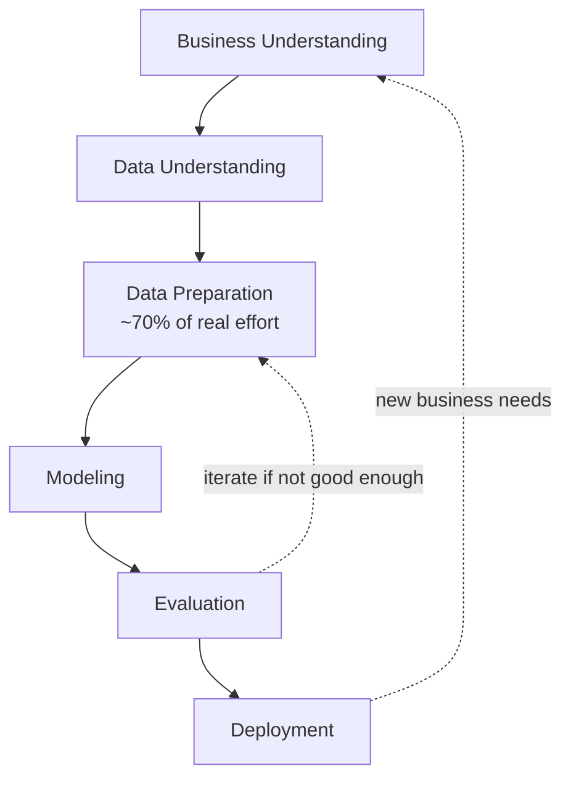

1. **Business Understanding** — define the problem and decision to support.
2. **Data Understanding** — explore what data exists and its quality.
3. **Data Preparation** — clean and transform data (~70% of real effort).
4. **Modeling** — apply algorithms.
5. **Evaluation** — does it solve the business problem?
6. **Deployment** — put the model into production use.

---

## Data Preprocessing

| Issue | What it means | Common fix |
|---|---|---|
| Missing values | Gaps in records | Delete, impute (mean/median/mode), or flag |
| Outliers | Extreme values | Investigate — error vs. genuine signal |
| Duplicates | Repeated records | Deduplicate |
| Scaling / normalization | Features on different ranges | Min-max scaling or standardization |
| Encoding categorical variables | Text categories | One-hot / label encoding |
| Feature selection | Irrelevant/redundant columns | Drop to reduce noise & overfitting |

### Simple Examples

| Issue | Example |
|---|---|
| Missing values | A student's `marks` field is blank → fill it with the class average. |
| Outliers | Someone's `age` is listed as 300 → clearly wrong, remove it. |
| Duplicates | "Rahul Sharma" appears twice in the same list → keep only one entry. |
| Scaling / normalization | `income` (in lakhs) and `age` (in years) are on very different scales → rescale both to 0–1. |
| Encoding categorical variables | `color` = Red/Blue/Green → convert to 0/1/2 (or one-hot columns) so the model can use it. |
| Feature selection | A `customer_id` column doesn't help predict anything → drop it. |

---

## The Five Task Families — Overview

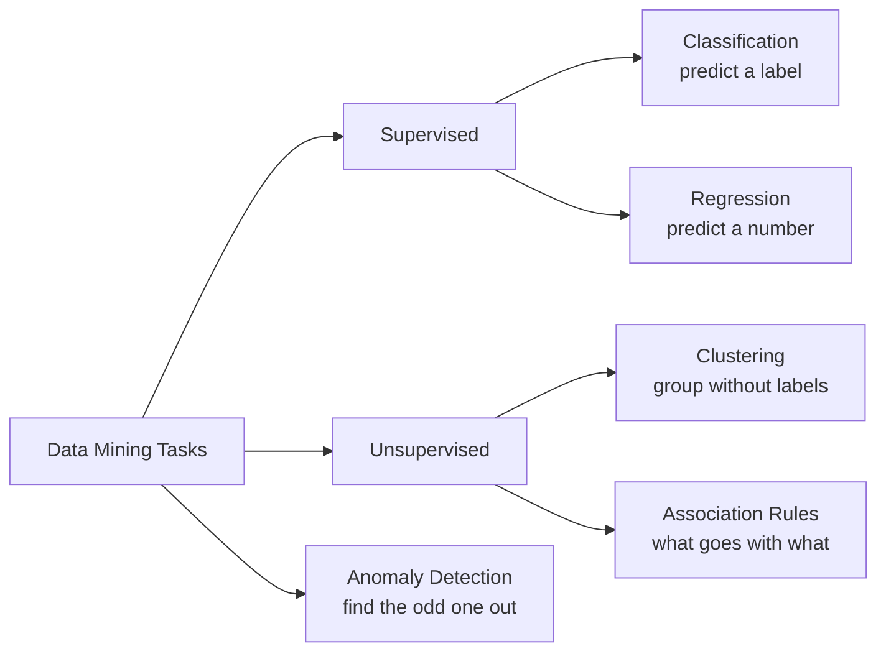

---

# 1. Classification — predict a label

**Goal:** assign each record to a known category.

### a) Decision Tree

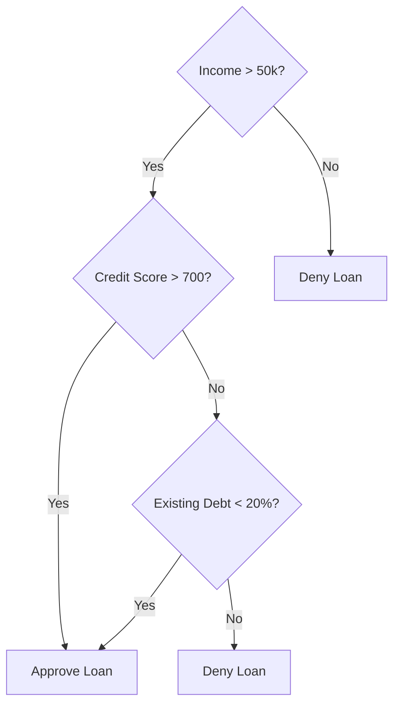
**Example:** A bank splits loan applicants by asking a series of yes/no questions (income, credit score, debt ratio) until it reaches a decision — approve or deny.

### b) k-Nearest Neighbors (k-NN)

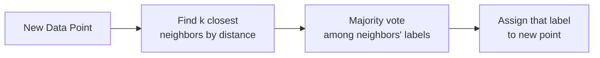

**Idea:** To predict something about a new item, check the most *similar* past items ("neighbors") and go with what most of them did.

**Practical Example: Loan Approval by Credit Score**

To predict if a new applicant will be approved for a loan, look at the k most similar past applicants (by credit score and income) and go with whichever outcome is most common among them.

| Applicant | Credit Score | Monthly Income (₹) | Loan Approved? |
|---|---|---|---|
| A | 750 | 80,000 | Yes |
| B | 780 | 85,000 | Yes |
| C | 400 | 20,000 | No |
| D | 420 | 22,000 | No |
| E | 760 | 82,000 | Yes |

A **new applicant** comes in: Credit Score 765, Income ₹83,000.

- **Choose k = 5** (check the 5 closest applicants).
- The 5 closest matches by credit score & income are **A, B, E** (Yes) and **C, D** (No).
- **Majority vote:** 3 "Yes" vs 2 "No" → predict **Loan Approved: Yes**.

**Key points:**
- **k** = how many neighbors to check.
- No formula is learned ahead of time — it just compares the new case to stored past cases each time.
- Features need to be on similar scales (credit score is roughly 300-900, income is in tens of thousands) or one will unfairly dominate the distance calculation — this is why scaling/normalization matters before running k-NN.

### c) Naive Bayes

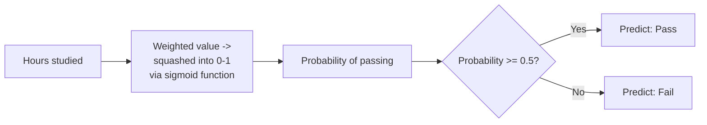

**Example:** Spam filters — the presence of words like "free," "win," "prize" raises the calculated probability that an email is spam. Each word is treated as an independent clue; the probabilities are combined to see whether "Spam" or "Not Spam" ends up more likely.

### d) Logistic Regression

**Idea:** Logistic regression doesn't guess the answer directly — it first estimates a probability, then applies a cutoff to make the final call.

**Example: Will a student pass the exam?**

Past data the model learns from:

| Student | Hours studied | Result |
|---|---|---|
| A | 1 | Fail |
| B | 2 | Fail |
| C | 6 | Pass |
| D | 8 | Pass |
| E | 9 | Pass |

From this, the model learns the pattern: *more hours studied → higher chance of passing.*

For a **new student**, it calculates a probability of passing based on hours studied:

| Hours studied | Calculated probability of passing |
|---|---|
| 1 | 0.10 |
| 3 | 0.35 |
| 5 | 0.60 |
| 7 | 0.80 |
| 9 | 0.92 |

Notice the probability doesn't rise in a straight line — it climbs slowly at first, speeds up in the middle, then levels off near 1. This S-shaped curve is the **sigmoid function**, and it guarantees the output always stays between 0 and 1 (unlike a straight line, which could go below 0 or above 1 — meaningless for a probability).

**Applying the threshold:** the model draws a cutoff at 0.5.
- Probability ≥ 0.5 → predict **Pass**
- Probability < 0.5 → predict **Fail**

A **new student who studied 5 hours** → probability = 0.60 → since 0.60 ≥ 0.5 → **Predict: Pass**

---

# 2. Regression — predict a number

### Linear Regression

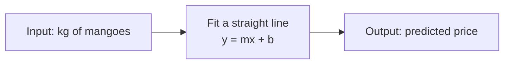

**Idea:** Linear regression finds the straight line that best fits past data, then uses that line to predict a number for new inputs.

**Simple example: Buying mangoes**

| Kg of mangoes | Price (₹) |
|---|---|
| 1 | 50 |
| 2 | 100 |
| 3 | 150 |

The pattern is steady: every extra kg adds ₹50. So for **5 kg**, without needing a chart: **5 × 50 = ₹250**.

### The formula: y = mx + b

| Symbol | Meaning | Mango example |
|---|---|---|
| x | input (what you know) | kg of mangoes |
| y | output (what you're predicting) | price |
| m | slope — how much y changes per unit of x | 50 (₹ per kg) |
| b | intercept — starting value when x = 0 | 0 (no mangoes = no cost) |

So the line is: **y = 50x + 0**

- 1 kg → y = 50(1) = ₹50
- 5 kg → y = 50(5) = ₹250

If the shop also charged a flat ₹20 delivery fee, the line would become **y = 50x + 20** — that ₹20 is the "b," what you'd pay even at 0 kg.

---

# 3. Clustering — group without labels

### a) k-Means

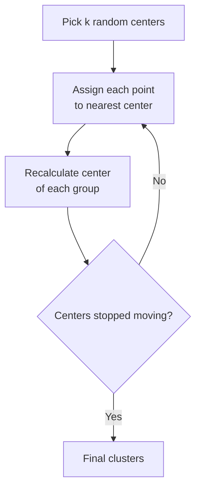
**Example:** Grouping customers into 3 segments (budget, mid-range, premium shoppers) based on spending habits — with no pre-existing labels.

### b) Hierarchical Clustering

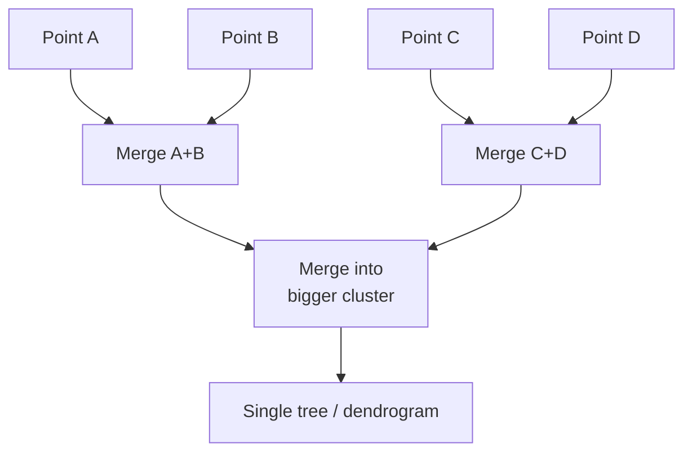
**Example:** Grouping species of plants by similarity, building a "family tree" (dendrogram) that shows which groups merge together at each level of similarity.

---

# 4. Association Rules — what goes with what

### Apriori / Market Basket Analysis

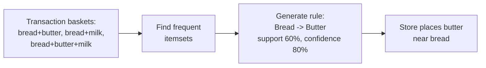
**Example:** A supermarket finds "customers who buy bread also buy butter 80% of the time," so it places butter near the bread aisle.

---

# 5. Anomaly Detection — find the odd one out

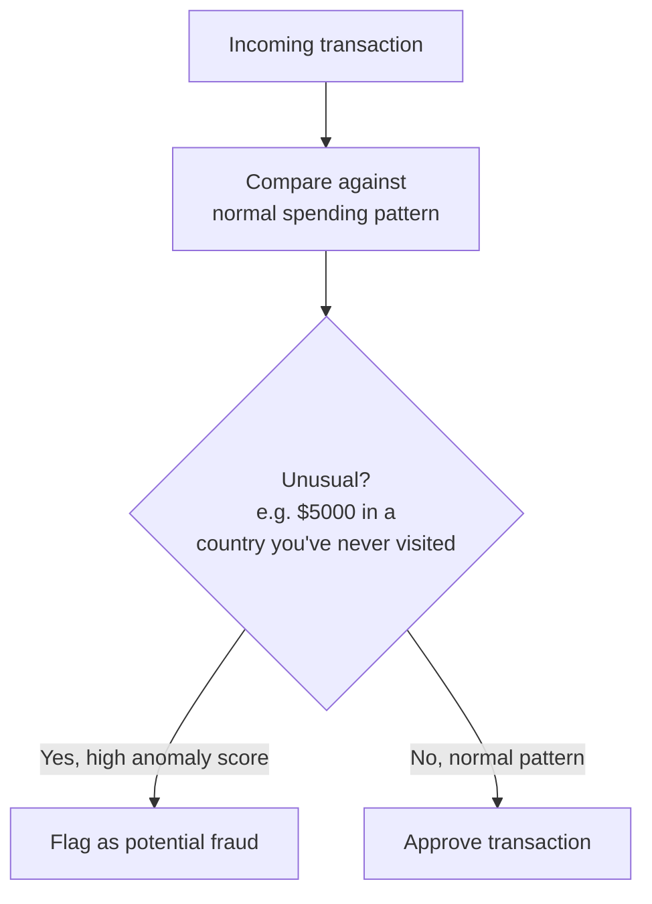
**Example:** Credit card fraud detection — a $5,000 purchase in a country you've never visited, made 2 minutes after a purchase at home, gets flagged as anomalous.

---

## Supervised vs Unsupervised

- **Supervised** (has a known "answer column"): Classification, Regression.
- **Unsupervised** (no answer column): Clustering, Association Rules.
- **Anomaly Detection**: can be either, depending on whether labeled examples exist.

---

## Train/Test Split, Overfitting, Cross-Validation

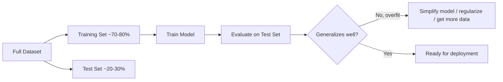

- **Train/test split** — never evaluate on data the model already learned from.
- **Overfitting** — model memorizes training data (including noise) instead of the general pattern.
- **100% training accuracy is suspicious** — usually means memorization, not real learning.
- **Cross-validation** — splits data into *k* folds, rotates the held-out fold, averages results for a more robust score.

